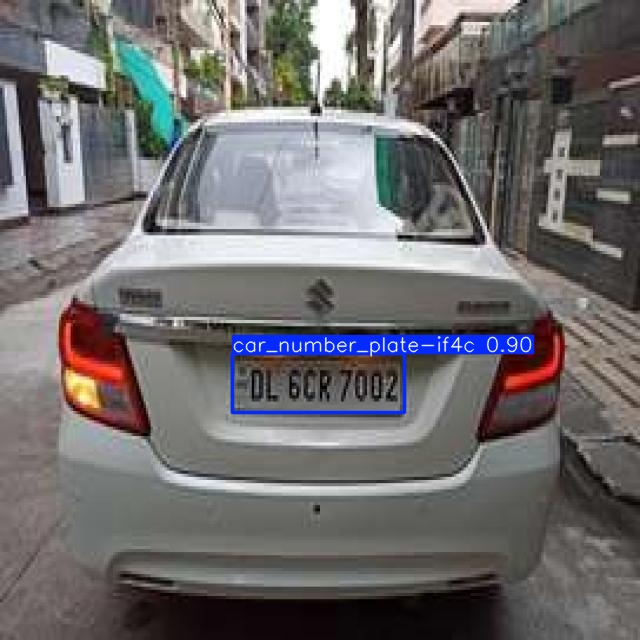
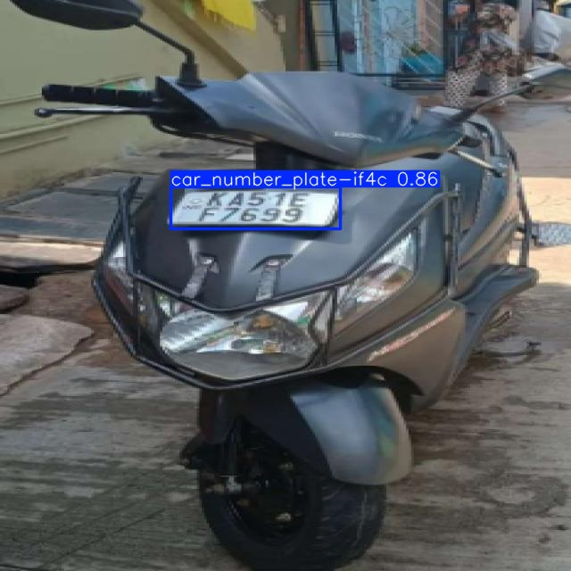

# 🚗 Car Number Plate Detection (ANPR)

This project implements an **Automatic Number Plate Recognition (ANPR)** system using **YOLOv8** and **EasyOCR**.

It can detect vehicle number plates in real-time and extract the text using OCR from images, videos, and live webcam feed.

---

## 🔥 Features

- Real-time detection using webcam
- OCR using EasyOCR
- Custom-trained YOLOv8 model
- Supports images and live video
- Cropping and preprocessing for better accuracy

---

## 📸 Demo

| Detection 1 | Detection 2 |
|------------|------------|
|  |  |

---

## 🧠 Tech Stack

- Python
- YOLOv8 (Ultralytics)
- OpenCV
- EasyOCR
- NumPy

---

## ⚙️ Workflow

1. Input image/video frame
2. YOLOv8 detects number plate region
3. Crop detected plate
4. Apply preprocessing (grayscale, filtering, resizing)
5. EasyOCR extracts text
6. Display output with bounding box and recognized number

---

## 🚀 How to Run

### 1. Install dependencies
```bash
pip install -r requirements.txt